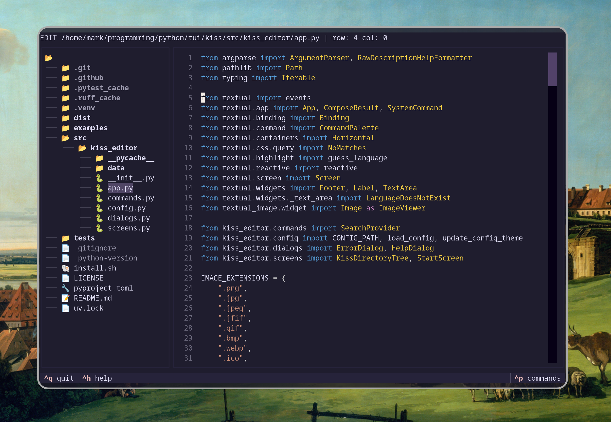

<p align="center">
  
</p>

<p align="center">
  <strong>KISS</strong> — <em>keep it simple, stupid.</em>
</p>

A small terminal editor built with [Textual](https://github.com/Textualize/textual).
It opens files and folders, with syntax highlighting, a file tree and undo/redo.
Just an editor — no LSP, no plugins, no ambitions to become an IDE.

---

## About

| What                                                       | Why                                                              |
| ---------------------------------------------------------- | ---------------------------------------------------------------- |
| [Textual](https://github.com/Textualize/textual) framework | A modern Python TUI framework — no curses                        |
| Minimal feature set                                        | Editing files first; LSP and plugins aren't a priority right now |
| Fast startup                                               | Comfortable to reach for as your default editor                  |

## Status

KISS is early-stage software. It's not a replacement for nano or vim — just a
small editor that tries to stay simple and useful. Some things are still
missing (see [TODO](#todo)).

---

## Install

via package managers:

```bash
[uv tool / pipx] install kiss-editor
```

or from source (requires Python 3.12+ and [uv](https://docs.astral.sh/uv/)):

```bash
git clone https://github.com/levk-m/kiss.git
cd kiss
uv sync
uv run kiss
```

Or run directly without cloning:

```bash
uvx kiss-editor
```

---

## Usage

```
kiss <file>         Edit a file
kiss <dir>          Browse a directory
kiss .              Open current directory
```

---

## Features

- **File tree** — browse and open files from the sidebar
- **Syntax highlighting** — auto-detected, Dracula by default
- **Command palette** (`Ctrl+P`) — fuzzy-find files, switch themes
- **Undo / Redo** — `Ctrl+Z` / `Ctrl+Y`
- **Clipboard** — cut, copy, paste (`Ctrl+X/C/V`)
- **Line numbers**, word wrap, cursor line highlight
- **Config** — `~/.kiss_conf.json`, open with `Ctrl+O`
- **Help dialog** — `Ctrl+H`
- **Splash screen** — pyfiglet logo on startup
- **Status bar** — shows filename, unsaved changes (`*`), focus mode

---

## Keybindings

### Navigation

| Key                        | Action            |
| -------------------------- | ----------------- |
| Arrows                     | Move cursor       |
| `Home` / `Ctrl+A`          | Go to line start  |
| `End` / `Ctrl+E`           | Go to line end    |
| `PgUp` / `Ctrl+PgUp`       | Page up           |
| `PgDn` / `Ctrl+PgDn`       | Page down         |
| `Ctrl+Left` / `Ctrl+Right` | Page left / right |
| `Alt+Left`                 | Word start        |
| `Alt+Right`                | Word end          |

### Selection

| Key                         | Action                  |
| --------------------------- | ----------------------- |
| `Shift`+Arrows              | Select character / line |
| `Shift+Home`                | Select to line start    |
| `Shift+End`                 | Select to line end      |
| `Shift+PgUp` / `Shift+PgDn` | Select page up / down   |
| `F6`                        | Select current line     |
| `F7`                        | Select all              |

### Editing

| Key                            | Action                     |
| ------------------------------ | -------------------------- |
| `Backspace` / `Ctrl+Backspace` | Delete char before cursor  |
| `Delete` / `Ctrl+D`            | Delete char under cursor   |
| `Alt+Del`                      | Delete to start of word    |
| `Ctrl+U`                       | Delete to line start       |
| `Ctrl+K`                       | Delete to line end         |
| `Ctrl+Left` / `Ctrl+Right`     | Decrease / increase indent |
| `Ctrl+X` / `Super+X`           | Cut                        |
| `Ctrl+C` / `Super+C`           | Copy                       |
| `Ctrl+V`                       | Paste                      |
| `Ctrl+Z`                       | Undo                       |
| `Ctrl+Y`                       | Redo                       |

### Interface

| Key                 | Action                            |
| ------------------- | --------------------------------- |
| `Tab` / `Shift+Tab` | Focus next / previous element     |
| `Ctrl+S`            | Save                              |
| `Ctrl+P`            | Command palette (files, themes)   |
| `Ctrl+H`            | Help dialog                       |
| `Ctrl+O`            | Open config (`~/.kiss_conf.json`) |
| `Ctrl+Q`            | Quit                              |

---

## Configuration

JSON config file at `~/.kiss_conf.json`. Open it with `Ctrl+O` — changes take effect after restart.
A copyable example lives at `examples/kiss_conf.json`.

```json
{
    "kiss": {
        "theme": "tokyo-night",
        "editor-theme": "dracula",
        "show_line_numbers": true,
        "soft_wrap": true,
        "highlight_cursor_line": false,
        "start-screen": false
    }
}
```

| Key                          | Default         | Description                   |
| ---------------------------- | --------------- | ----------------------------- |
| `kiss.theme`                 | `"tokyo-night"` | Application theme             |
| `kiss.editor-theme`          | `"dracula"`     | Syntax highlighting colors    |
| `kiss.show_line_numbers`     | `true`          | Show line numbers             |
| `kiss.soft_wrap`             | `true`          | Soft-wrap long lines          |
| `kiss.highlight_cursor_line` | `false`         | Highlight current line        |
| `kiss.start-screen`          | `false`         | Show splash screen on startup |

### Application themes

`textual-dark`, `textual-light`, `nord`, `gruvbox`, `catppuccin-mocha`,
`catppuccin-latte`, `catppuccin-frappe`, `catppuccin-macchiato`, `dracula`,
`tokyo-night`, `monokai`, `flexoki`, `solarized-light`, `solarized-dark`,
`rose-pine`, `rose-pine-moon`, `rose-pine-dawn`, `atom-one-dark`,
`atom-one-light`, `ansi-dark`, `ansi-light`

### Editor themes

`css`, `monokai`, `dracula`, `vscode_dark`, `github_light`

`css` is the default editor theme. It has no fixed background — it adapts to
the current application theme's palette, so the editor blends with the app UI.

---

## TODO

- **Enter handling** — auto-indent to match the current line on newline
- **Custom command palette** — replace the default Textual palette with a bespoke one

---

## License

MIT License.

**Repo:** [github.com/levk-m/kiss](https://github.com/levk-m/kiss)
